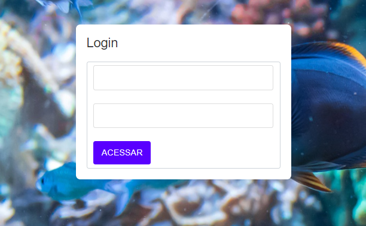
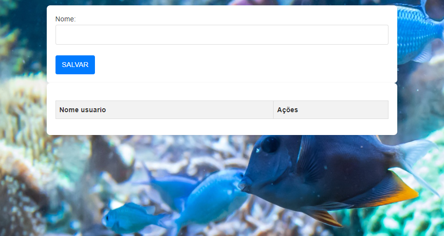

# login cad

Nesse projeto foi criado um sistema de registro de nomes utilizando HTML e JAVASCRIPT.

 ## 🔗 | Índice 

1. [Introdução](#🚀--introdução)
2. [Estrutura do Projeto](#🗂️--estrutura-do-projeto)
3. [HTML e CSS](#🖥️--html-e-css)
   - [Login](#🔑--login)
   - [Cadastro](#📝--cadastro)
4. [JavaScript](#🖥️--javascript)
   - [Validação de Login](#🛡️--validação-de-login)
   - [Cadastro de usuario](#✍️--cadastro-de-usuario)
   - [Edição](#✏️--edição-de-usuario)
   - [Excluir](#🗑️--excluir)
5. [Tecnoligias utilizadas](#tecnologias-utilizadas)
6. [Referências](#referencias)
7. [Autor](#autor)


--

## 🚀 | Introdução

No projeto foi criado duas telas, quais realizam o login e outra qual em uma lista guarda nomes.

--

## 🗂️ | Estrutura do Projeto

O projeto é composto pelos seguintes arquivos:
- `login.html`: Página de login.
- `cadrasto.html`: Página de cadastro de usuários.
- `controller.js`: Arquivo JavaScript de validação, cadastro e edição dos dados.

--

## 🖥️ | HTML e CSS

### 🔑 | Login



Arquivo: `login.html`


```html
<!DOCTYPE html>
<html>
<head>
    <meta charset='utf-8'>
    <meta http-equiv='X-UA-Compatible' content='IE=edge'>
    <title>Login</title>
    <meta name='viewport' content='width=device-width, initial-scale=1'>
    <link href="https://cdn.jsdelivr.net/npm/bootstrap@5.0.2/dist/css/bootstrap.min.css" rel="stylesheet"
        integrity="sha384-EVSTQN3/azprG1Anm3QDgpJLIm9Nao0Yz1ztcQTwFspd3yD65VohhpuuCOmLASjC" crossorigin="anonymous">
</head>
<body>
    <div class="container col-4">
        <h3>Login</h3>
        <form action="" class="form-control">
            <input type="text" id="loginEmail" class="form-control"><br>
            <input type="password" id="loginSenha" class="form-control"><br>
            <button onclick="acessar()" class="btn btn-warning" type="button">ACESSAR</button>
        </form>
    </div>    
    <script src='controller.js'></script>
</body>
</html>
```

>  Bootstrap 5 para estilização.

>  Formulário de Login: tem campos para email e senha e um botão para acessar a lista.

--

### 📝 | Cadastro



Arquivo: cadrasto.html


````html
<!DOCTYPE html>
<html>
<head>
    <meta charset='utf-8'>
    <meta http-equiv='X-UA-Compatible' content='IE=edge'>
    <title>Cadrasto</title>
    <meta name='viewport' content='width=device-width, initial-scale=1'>
    <link href="https://cdn.jsdelivr.net/npm/bootstrap@5.0.2/dist/css/bootstrap.min.css" rel="stylesheet"
    integrity="sha384-EVSTQN3/azprG1Anm3QDgpJLIm9Nao0Yz1ztcQTwFspd3yD65VohhpuuCOmLASjC" crossorigin="anonymous">
</head>
<body>
    <div class="container">
        <label for="">Nome:</label><br>
        <input type="text" id="nomeUser" class="form-control"><br>
        <button class="btn btn-primary" type="button" onclick="salvarUser()">SALVAR</button>
    </div>
    <div class="container">
        <table class="table table-striped" id="tabela">
            <tr>
                <th>Nome usuario</th>
                <th>Ações</th>
            </tr>
        </table>
    </div>
    <script src='controller.js'></script>
</body>
</html>
````

> Criação da Lista: Atualiza a tabela com a lista de usuários.

> Edição: Possibilitar editar um nome armazenado após registra-lo.

--
### 🖥️ | JavaScript


####  🛡️ | validação de login

Arquivo: controller.js

``` validação
function criaLista() {
    let tabela = "<tr><th>Nome de usuário</th><th>Ações</th></tr>";
    for (let i = 0; i < dadosListas.length; i++) {
        tabela += "<tr><td>" + dadosListas[i] + "</td><td><button type='button' onclick='editar(" + i + ")'>Editar</button></td></tr>";
    }
    document.getElementById('tabela').innerHTML = tabela;
}

function editar(i) {
    document.getElementById('nomeUser').value = dadosListas[i];
    dadosListas.splice(i, 1);
    criaLista();
}
````
--

## ✍️ | cadastro de usuario

````
var dadosListas = [];

function salvarUser() {
    let nomeUser = document.getElementById('nomeUser').value;

    if (nomeUser) {
        dadosListas.push(nomeUser);
        criaLista();
        document.getElementById('nomeUser').value = "";
    } else {
        alert('Favor informar o nome para cadastro');
    }
}
````

> Armazenamento de Dados: Cria um array que guarda um nome no dadosListas e atualiza a tabela com a função criaLista.

--

### ✏️ | Edição de usuario

````
function criaLista() {
    let tabela = "<tr><th>Nome de usuário</th><th>Ações</th></tr>";
    for (let i = 0; i < dadosListas.length; i++) {
        tabela += "<tr><td>" + dadosListas[i] + "</td><td><button type='button' onclick='editar(" + i + ")'>Editar</button></td></tr>";
    }
    document.getElementById('tabela').innerHTML = tabela;
}

function editar(i) {
    document.getElementById('nomeUser').value = dadosListas[i];
    dadosListas.splice(i, 1);
    criaLista();
}
````

> Edição: Permite editar o nome registrado, removendo-o da lista e preenchendo o campo de texto com o nome escolhido.

### 🗑️ | Excluir

````
function excluir(i){
    dadosListas.splice((i-1), 1);
    document.getElementById('tabela').deleteRow(i);
}
````

> Excluir: Permite o usuário deletar um nome.

## Tecnologias utilizadas

- HTML
- JAVASCRIPT
- CSS
- BOOTSTRAP5

## Referencias

[FREECODECAMP](https://www.freecodecamp.org/portuguese/news/splice-em-javascript-como-usar-o-metodo-de-array-splice-em-js/)

[FREEPIK](https://br.freepik.com/)

## Autor

[Sarah](https://github.com/SarahLSilva)

